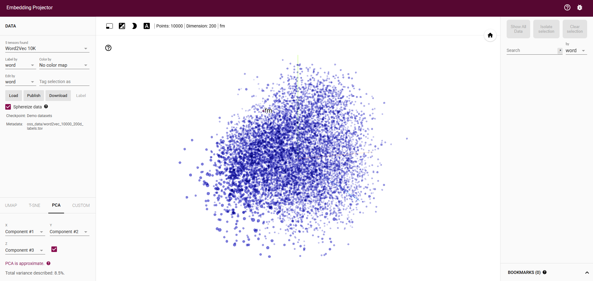

# Vector Explorer

Vector Explorer es una herramienta interactiva que permite explorar y visualizar embeddings de modelos de procesamiento de lenguaje natural (NLP). La aplicación facilita la extracción de embeddings del vocabulario completo de diferentes modelos y su visualización en TensorBoard.

## 🎯 Propósitos y Casos de Uso

Esta herramienta puede ser especialmente útil para:

### Investigación y Análisis

- **Análisis Semántico**: Explorar relaciones semánticas entre palabras y conceptos
- **Evaluación de Modelos**: Comparar diferentes modelos de embeddings y su calidad
- **Análisis de Sesgos**: Identificar posibles sesgos en los modelos de lenguaje
- **Investigación Lingüística**: Estudiar relaciones léxicas y campos semánticos

### Desarrollo y Aplicaciones

- **Selección de Modelos**: Ayuda a elegir el modelo más adecuado para tu aplicación
- **Optimización de Embeddings**: Analizar y mejorar representaciones vectoriales
- **Desarrollo de Chatbots**: Mejorar sistemas de procesamiento de lenguaje natural
- **Sistemas de Búsqueda**: Implementar búsquedas semánticas más precisas

### Educación y Visualización

- **Enseñanza de NLP**: Herramienta didáctica para entender embeddings
- **Demostración Visual**: Mostrar cómo las palabras se relacionan en el espacio vectorial
- **Experimentación**: Facilitar la experimentación con diferentes modelos
- **Documentación**: Generar visualizaciones para documentación y presentaciones

## 🌟 Características

- **Extracción de Embeddings**: Permite extraer embeddings del vocabulario completo de diferentes modelos preentrenados.
- **Visualización Interactiva**: Integración con TensorBoard para visualizar los embeddings en un espacio tridimensional.
- **Interfaz CLI Amigable**: Interfaz de línea de comandos interactiva para facilitar el uso.

## 👀 Vídeo recomendado

- [DotCSV - ¿Qué es Word2Vec? (YouTube)](https://youtu.be/RkYuH_K7Fx4)

## 📄 Paper original de Word2Vec

- [Word2Vec: Efficient Estimation of Word Representations in Vector Space (Mikolov et al., 2013)](https://arxiv.org/pdf/1301.3781)

## 🛠️ Estructura del Proyecto

```
vector-explorer/
├── config/
│   └── config.json          # Configuración del proyecto
├── embeddings_output/       # Directorio donde se guardan los embeddings
│   ├── metadata.tsv
│   ├── projector_config.pbtxt
│   └── tensor.tsv
├── src/
│   ├── cli/
│   │   └── interactive.py   # Interfaz de línea de comandos
│   ├── models/
│   │   ├── embedding_writer.py  # Gestión de escritura de embeddings
│   │   └── model_manager.py     # Gestión de modelos
│   └── utils/
│       ├── config.py        # Utilidades de configuración
│       └── tensorboard.py   # Gestión de TensorBoard
└── requirements.txt         # Dependencias del proyecto
```

## 📋 Requisitos

- Python 3.11 o superior
- TensorFlow y TensorBoard
- PyTorch
- Transformers (Hugging Face)

## 🚀 Instalación

1. Clonar el repositorio:

```bash
git clone https://github.com/yourusername/vector-explorer.git
cd vector-explorer
```

2. Crear un entorno virtual (recomendado):

```bash
python -m venv myenv
```

3. Instalar dependencias:

```bash
pip install -r requirements.txt
```

## 💻 Uso

1. Activar el entorno virtual:

```bash
.\myenv\Scripts\activate
```

2. Ejecutar la aplicación:

```bash
python main.py
```

3. Seleccionar una opción del menú:
   - **Extraer embeddings**: Extrae los embeddings del vocabulario completo del modelo seleccionado
   - **Visualizar embeddings existentes**: Abre TensorBoard para visualizar embeddings previamente extraídos
   - **Salir**: Cierra la aplicación

## 📊 Visualización de Embeddings

Después de extraer los embeddings, TensorBoard se iniciará automáticamente. Puedes acceder a la visualización en:

```
http://localhost:6006
```

En TensorBoard podrás:

- Visualizar los embeddings en 3D
- Buscar palabras específicas
- Analizar relaciones semánticas entre palabras
- Explorar clusters de palabras similares



## 📁 Archivos Generados

- **tensor.tsv**: Contiene los vectores de embeddings
- **metadata.tsv**: Contiene los tokens correspondientes
- **projector_config.pbtxt**: Configuración para TensorBoard

## 📬 Contacto

- Si tienes alguna duda, o necesitas ayuda, podemos conectar en [Linkedin](https://www.linkedin.com/in/virtuanista/).
- Si quieres compartir el proyecto: [https://github.com/virtuanista/vector-explorer](https://github.com/virtuanista/vector-explorer)
- Wiki [Enlace directo](https://deepwiki.com/virtuanista/vector-explorer).
- Si te ha gustado, una estrellita es bienvenida ⭐

## 📄 Licencia

<p align="center">
	Repositorio generado por <a href="https://github.com/virtuanista" target="_blank">virtu 🎣</a>
</p>

<p align="center">
	
</p>

<p align="center">
	Copyright © 2025
</p>

<p align="center">
	<a href="/LICENSE"></a>
</p>
